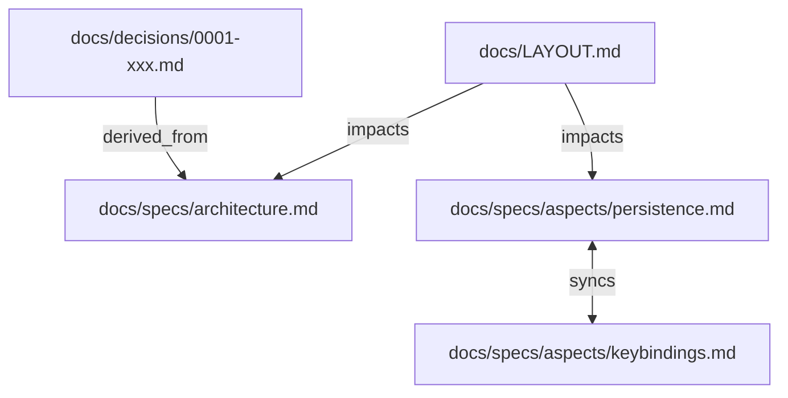

# aidea.docs-graph — ドキュメント関係グラフ生成

`/aidea.docs-graph` スキルを実行すると、`docs/` 配下の Markdown ファイルが持つ frontmatter を解析し、ドキュメント間の依存関係を Mermaid フローチャートとして出力する。

## 目的

docs の frontmatter (`derived_from` / `syncs_with` / `impacts`) は、ドキュメント同士の関連性を機械可読な形で宣言している。このスキルはその関係を視覚的なグラフとして提示し、以下を可能にする。

- **影響範囲の把握**: ドキュメント A を変更したとき、どのドキュメントに波及するかを一目で確認する
- **断絶の検出**: 孤立したドキュメント (関係が宣言されていない / 参照されていない) を発見する
- **全体構造の俯瞰**: `derived_from` → `syncs_with` → `impacts` の連鎖をグラフとして把握する

---

## 出力フォーマット

Mermaid の `flowchart TD` (Top Down) 形式。標準出力 (Claude のレスポンス) にコードブロックとして表示する。

### エッジの種類

| frontmatter フィールド | エッジ方向 | ラベル | 線種 |
|---|---|---|---|
| `derived_from: [B]` | A → B | `derived_from` | 破線 (`-.->`) |
| `impacts: [C]` | A → C | `impacts` | 実線 (`-->`) |
| `syncs_with: [D]` | A ↔ D | `syncs` | 双方向実線 (`<-->`) |

`syncs_with` は双方向宣言のため、A が `syncs_with: [B]`、B が `syncs_with: [A]` の場合でも辺は 1 本として表示する (重複除去)。

---

## 対象ファイル

- `docs/` 配下の全 `.md` ファイル
- frontmatter が存在しない (YAML `---` ブロックがない) ファイルはノードのみ表示し、エッジは張らない
- ワイルドカード (`docs/specs/aspects/*` 等) は対象ディレクトリ配下の全ファイルに展開して処理する

---

## ノードの表示

ファイルパス (リポジトリルート相対) をノード ID と表示名に使用する。表示が長い場合は `docs/specs/…/filename.md` のように省略してよい。

---

## オプション (引数)

引数なしで全ドキュメントを対象にする。以下の引数を指定すると出力を絞り込む。

| 引数 | 例 | 動作 |
|---|---|---|
| ファイルパス | `docs/specs/aspects/persistence.md` | 指定ファイルを起点に 1 ホップ以内の関連ノードのみ出力 |
| ディレクトリ | `docs/specs/aspects/` | 配下のファイルを対象 |
| `--depth N` | `--depth 2` | 起点ファイル指定時の展開深さ (デフォルト 1) |

---

## 境界

### Always

- Mermaid コードブロックをレスポンス本文に出力する
- ノード ID は Mermaid で使用できない文字 (`.` `/` `-`) を `_` に変換する
- `syncs_with` の重複エッジは 1 本に集約する

### Never

- ファイルを生成・変更しない (読み取り専用スキル)
- frontmatter が存在しないファイルをエラーとして扱わない (孤立ノードとして表示する)

---

## 関連ドキュメント

- [docs/LAYOUT.md](../../LAYOUT.md) — frontmatter 規約 (`derived_from` / `syncs_with` / `impacts` の定義)
- [../skills/README.md](./README.md) — Skills 仕様インデックス
